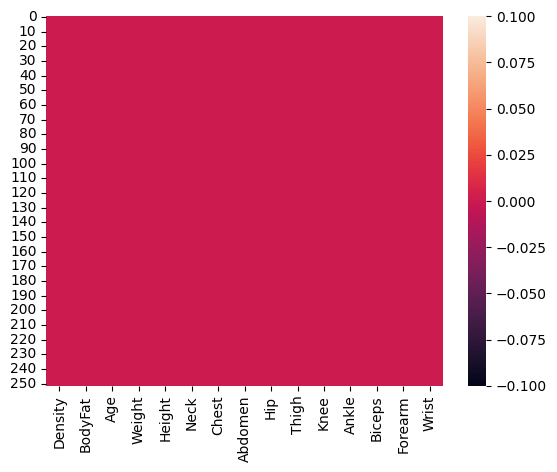
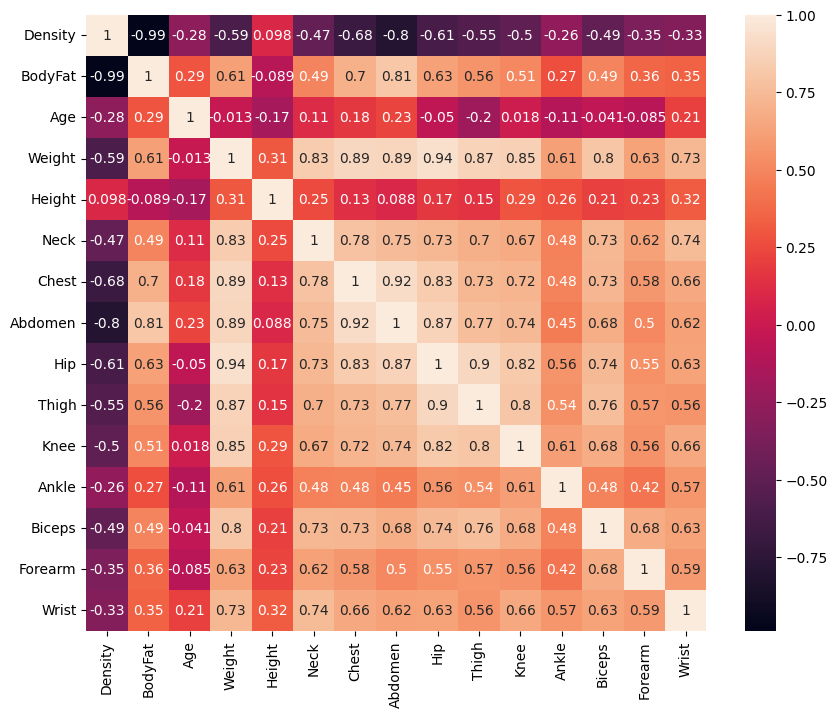
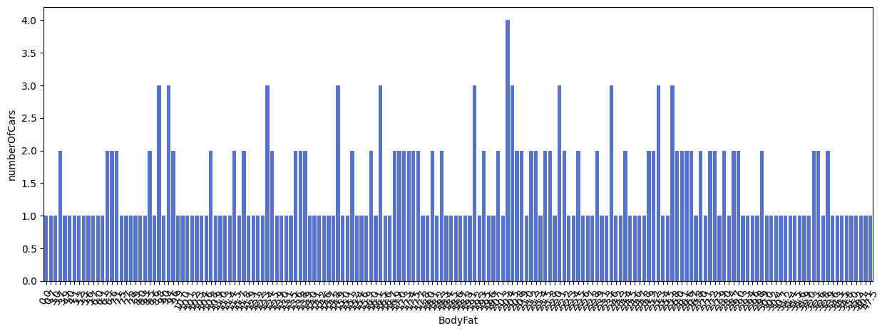
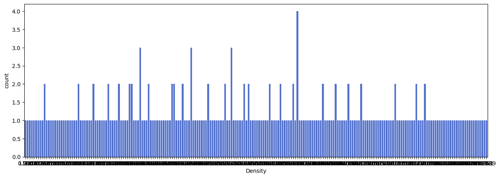
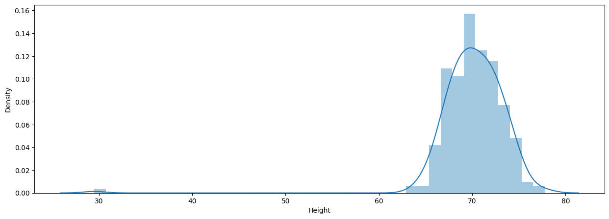
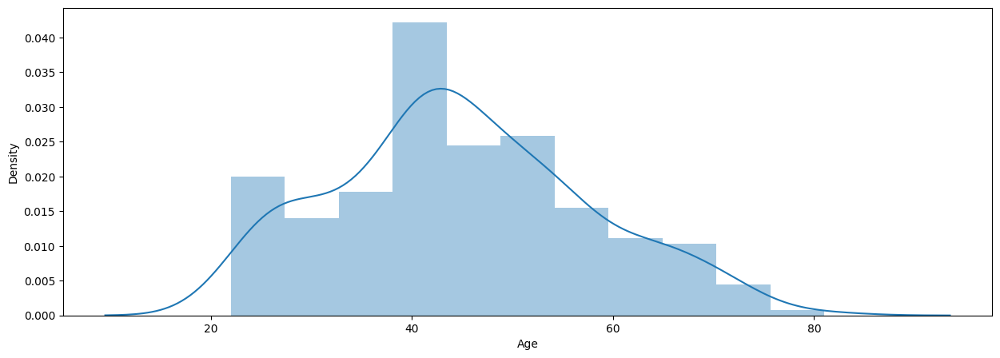
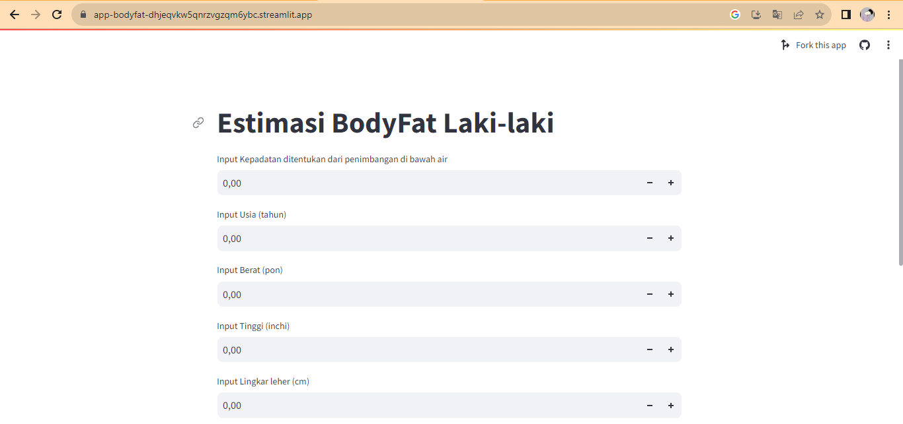

# Laporan Proyek Machine Learning

### Nama : Putri Carellilas Fony

### Nim : 211351113

### Kelas : Pagi A

## Domain Proyek

Proyek ini dapat digunakan memperkiraan persentase lemak tubuh karena informasi penting dalam berbagai bidang, termasuk ilmu olahraga, kesehatan, dan penelitian medis. Lemak tubuh yang berlebih dapat menjadi faktor risiko kesehatan yang serius. Namun, pengukuran lemak tubuh yang akurat sering kali memerlukan peralatan mahal, prosedur rumit, dan penimbangan di bawah air, yang tidak praktis atau terlalu mahal untuk digunakan dalam situasi umum. Oleh karena itu, terdapat kebutuhan untuk mengembangkan metode prediksi yang lebih sederhana dan ekonomis untuk memperkirakan persentase lemak tubuh tanpa harus melakukan pengukuran yang rumit.

## Business Understanding

Bisa mengecek perkiraan persentase lemak tubuh tanpa harus melibatkan prosedur yang rumit dan peralatan mahal. 

### Problem Statements

- Dalam kasus ini, masalah yang saya jelajahi adalah masalah peralatan mahal, prosedur rumit, dan penimbangan di bawah air, yang tidak praktis atau terlalu mahal untuk digunakan

### Goals

- mencari solusi untuk memudahkan orang-orang yang ingin mengecek persentase lemak tubuh

### Solution statements

Pengembangan Aplikasi Web Prediksi Lemak Tubuh: Untuk mempermudah akses dan penggunaan, pengembangan aplikasi web yang memungkinkan individu untuk memasukkan pengukuran lingkar tubuh dan variabel lainnya, dan kemudian menghasilkan perkiraan persentase lemak tubuh secara instan.

## Data Understanding

Mencantumkan perkiraan persentase lemak tubuh yang ditentukan melalui
penimbangan di bawah air dan berbagai pengukuran lingkar tubuh untuk 252 pria.
Data ini digunakan untuk menghasilkan persamaan prediksi berat badan tanpa lemak yang diberikan dalam abstrak "Persamaan prediksi komposisi tubuh umum untuk pria menggunakan teknik pengukuran sederhana", KW Penrose, AG Nelson, AG Fisher, FACSM, Human Performance Research Center, Universitas Brigham Young , Provo, Utah 84602 sebagaimana tercantum dalam Kedokteran dan Sains dalam Olahraga dan Latihan , vol. 17, tidak. 2 April 1985, hal. 189. (Persamaan prediksi diperoleh dari 143 pertama dari 252 kasus yang tercantum di bawah)
<br>
[Klasifikasi Penyakit Jantung] (https://www.kaggle.com/datasets/fedesoriano/body-fat-prediction-dataset).

### Variabel-variabel  Prediksi BodyFat(Lemak Tubuh) adalah sebagai berikut:

- Density = Kepadatan ditentukan dari penimbangan di bawah air dengan type data (float64)
- BodyFat = Persen lemak tubuh dari persamaan Siri (1956). dengan type data (float64)
- Age = Usia (tahun) dengan type data (int64)
- Weight = Berat (pon), dengan type data (float64)
- Heigt = Tinggi (inchi), dengan type data (float64)
- Neck = Lingkar leher (cm), dengan type data (float64)
- Chesk = Lingkar dada (cm), dengan type data (float64)
- Abdomen = Lingkar perut 2 (cm), dengan type data (float64)
- Hip = Lingkar pinggul (cm), dengan type data (float64)
- Thigh = Lingkar paha (cm), dengan type data (float64)

## Data Preparation

### Data Collection

Untuk data collection ini, saya mendapatkan dataset yang nantinya digunakan dari website kaggle dengan nama dataset Body Fat Prediction Dataset, jika anda tertarik dengan datasetnya, anda bisa click link diatas.

### Data Discovery And Profiling

Untuk bagian ini, kita akan menggunakan teknik EDA. <br>
Pertama kita mengimport semua library yang dibutuhkan,

```bash
import numpy as np
import pandas as pd
import matplotlib.pyplot as plt
import seaborn as sns
```

Karena kita menggunakan google colab untuk mengerjakannya maka kita akan import files juga,

```bash
from google.colab import files
```

Lalu mengupload token kaggle agar nanti bisa mendownload sebuah dataset dari kaggle melalui google colab

```bash
file.upload()
```

Setelah mengupload filenya, maka kita akan lanjut dengan membuat sebuah folder untuk menyimpan file kaggle.json yang sudah diupload tadi

```bash
!mkdir -p ~/.kaggle
!cp kaggle.json ~/.kaggle/
!chmod 600 ~/.kaggle/kaggle.json
!ls ~/.kaggle
```

Done, lalu mari kita download datasetsnya

```bash
!kaggle datasets download -d fedesoriano/body-fat-prediction-dataset
```

Selanjutnya kita harus extract file yang tadi telah didownload

```bash
!mkdir body-fat-prediction-dataset.zip
!unzip body-fat-prediction-dataset.zip -d body-fat-prediction-dataset
!ls body-fat-prediction-dataset
```

Mari lanjut dengan memasukkan file csv yang telah diextract pada sebuah variable, dan melihat 5 data paling atas dari datasetsnya

```bash
df = pd.read_csv('bodyfat.csv')
df.shape
```

Untuk melihat beberapa baris pertama dari sebuah DataFrame.,

```bash
df.head()
```
Untuk melihat mengenai type data dari masing masing kolom kita bisa menggunakan property info,

```bash
df.info()
```

Untuk melihat beberapa baris terakhir dari sebuah DataFrame.

```bash
sns.heatmap(df.isnull())
```


menghasilkan statistik deskriptif tentang DataFrame, seperti rata-rata, median, kuartil, dan lainnya, untuk setiap kolom numerik dalam DataFrame
```bash
df.describe()
```

Mari kita lanjut dengan visualisai data kita, dan akan munsul atribut yang numerik atau integer
``` bash
plt.figure(figsize=(10,8))
sns.heatmap(df.corr(), annot=True)
```


Membuat beberapa plot atau garfik

peratama membuat jumlah bodyfat berdasarkan weigt
``` bash
BodyFat = df.groupby('BodyFat').count()[['Weight']].sort_values(by='Weight',ascending=True).reset_index()
BodyFat = BodyFat.rename(columns={'Weight':'numberOfCars'})
``` 
Lalu membuat tipikal grafik dalam bentuk barplot
``` bash
fig = plt.figure(figsize=(15,5))
sns.barplot(x=BodyFat['BodyFat'], y=BodyFat['numberOfCars'],color='royalblue')
plt.xticks(rotation=60)
``` 

yang Kedua Membuat ukuran Desity berdasarkan Weight
``` bash
Density = df.groupby('Density').count()[['Weight']].sort_values(by='Weight').reset_index()
Density = Density.rename(columns={'Weight':'count'})
``` 
Lalu membuat tipikal grafik dalam bentuk barplot
``` bash
plt.figure(figsize=(15,5))
sns.barplot(x=Density['Density'], y=Density['count'], color='royalblue')
``` 


ketiga membuat plot menggunakan distribusi atau displot

- Distribusi Height
``` bash
plt.figure(figsize=(15,5))
sns.distplot(df['Height'])
``` 
hasilnya kita mendapatkan nilai distribusi dari height(tinggi)


- Distribusi Height
``` bash
plt.figure(figsize=(15,5))
sns.distplot(df['Age'])
``` 
hasilnya kita mendapatkan nilai distribusi dari age(umur)


kita berhasil melakukan plotdataset, mendeskripsikan dataset dan memberikan informasi dari grafik.

mari lanjut dengan modeling.

## Modeling

Langkah pertama kita melakukan seleksi fitur karena tidak semua antribut yang ada didataset kita pakai

Memilih fitur yang ada di dataset dan penamaan atau huruf harus sama seperti di dataset supaya terpanggil serta menentukan featurs dan labels
``` bash
features = ['Density','Age','Weight','Height','Neck','Chest','Abdomen','Hip','Thigh']
x = df[features]
y = df['BodyFat']
x.shape, y.shape
``` 
sebelumnya mari kita import library yang nanti akan digunakan,
``` bash
from sklearn.model_selection import train_test_split
from sklearn.linear_model import LinearRegression
```
Membuat model regresi linier dan memasukkan modul dari sklearn(memasukkan library)
 ``` bash
from sklearn.linear_model import LinearRegression
lr = LinearRegression()
lr.fit(x_train,y_train)
pred = lr.predict(x_test)
 ``` 

nah, selesai, sekarang kita bisa melihat score dari model kita,
``` bash
score = lr.score(x_test, y_test)
print('akurasi model regresi linier =', score)
```
akurasi model regresi linier = 0.9915851438136186 atau 99,15%, alright mari kita test menggunakan sebuah array value
``` bash
#Density=1.0708, Age=23, Weight=154.25, Height67.75, Neck=36.2, Chest=93.1, Abdomen=85.2, Hip=94.5, Thigh=59.0
input_data = np.array([[1.0708,23,154.25,67.75,36.2,93.1,85.2,94.5,59.0]])

prediction = lr.predict(input_data)
print('Estimasi BodyFat dalam persen:', prediction)
```
wow, berhasil!!, sekarang modelnya sudah selesai, mari kita export sebagai sav agar nanti bisa kita gunakan pada project web streamlit kita.
``` bash
import pickle
filename = 'Estimasi_BodyFat.sav'
pickle.dump(lr,open(filename,'wb'))
```


## Evaluation

### Impor pustaka yang diperlukan
from sklearn.model_selection import train_test_split
from sklearn.linear_model import LinearRegression

### Muat Dataset
data = Body Fat Prediction Dataset

x = data.data

y = data.target

### Bagi data menjadi data strening dan data testing
x_train, x_test, y_train, y_test = train_test_split(x,y,random_state=70)

y_test.shape

### Inisialisasi model
lr = LinearRegression()

lr.fit(x_train,y_train)

pred = lr.predict(x_test)

### Menhitung score atau akurasi
score = lr.score(x_test, y_test)

print('akurasi model regresi linier =', score)

## Deployment

[My Estimation App](https://app-bodyfat-dhjeqvkw5qnrzvgzqm6ybc.streamlit.app/).


